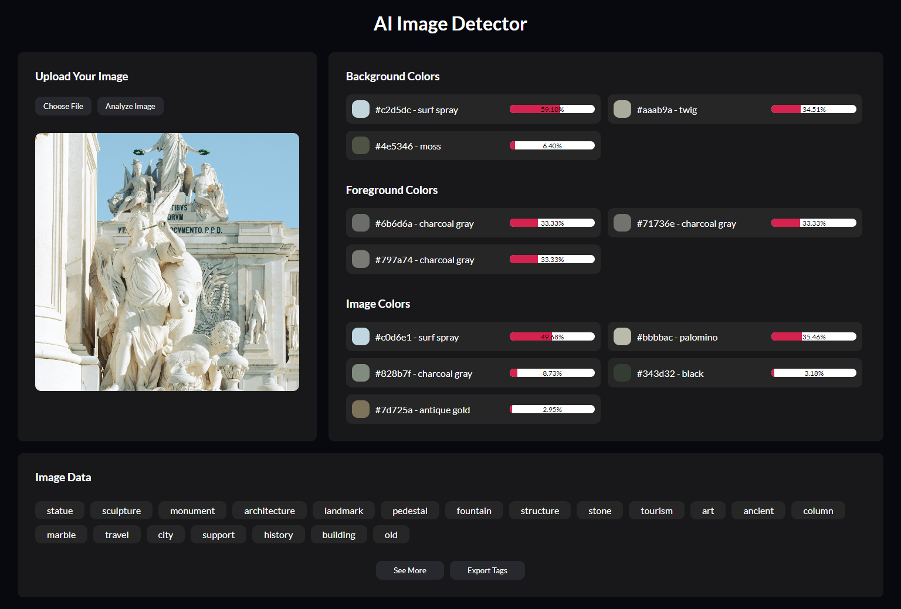

### AI Image Detector
JavaScript AI Image Detector: Analyze Images and Extract Tags & Colors! 🌈

- Introduction to AI-Powered Image Detection API: We will use Imagga API to analyze images🤖
- Tagging and Color Extraction: See how to analyze images, extract relevant tags, and identify dominant colors to create stunning user experiences. 🎨
- Step-by-Step JavaScript Implementation: Follow along with our detailed coding tutorial, from setting up your project to integrating AI features. 💻
- User-Friendly Interface: Learn to design a responsive, engaging interface that displays image analysis results smoothly. 🌟
- Optimize for Performance: Tips and tricks to ensure your AI image detector runs efficiently on all devices! 📱

# Screenshot
Here we have project screenshot :

